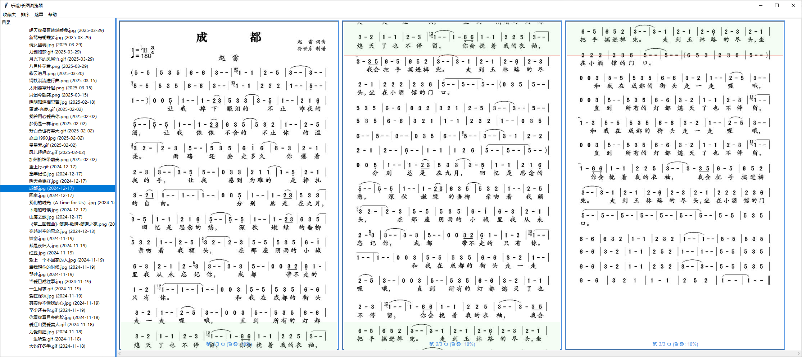

# Sheet Music and Long Image Viewer （乐谱/长图浏览器）

**Version: 1.0**

## 简介
**Sheet Music and Long Image Viewer（乐谱/长图浏览器）** 是一款专为浏览长图片（如乐谱、漫画、海报等）设计的工具。  
它能够将垂直方向超长的图像按设定的高度切割成多页并排展示，适用于演奏、超宽屏浏览等场景，提升查看长图的体验。

## 特性
- 支持超长图片（如钢琴谱、长漫画、学习资料）分段并排浏览
- 自定义切割比例
- 支持快速缩放查看
- 简洁直观的用户界面
- 支持多种常见图片格式（JPG, PNG, BMP等）
- 适配超宽屏显示器

## 下载与使用
- 你可以在 [Releases 页面](https://github.com/Jimi-from-mars/Sheet-music-and-long-image-viewer/releases/latest) 下载最新版本的**编译程序（Windows版）**，无需安装，解压后直接运行。
- 岛主为大家准备了新手乐谱资源包，可在[岛主博客](https://phuketlord.top/archives/19.html)免费下载。解压后与本软件放在同一文件夹内即可（放其他任何地方也没有问题）。
- 如果希望参与热火朝天的讨论，可加入[电吹管讨论群](https://t.me/+qKoZM2j2JyQ0NGI9)。

### 运行方式
- **方式一**：下载编译版（推荐，适合普通用户）
- **方式二**：克隆本仓库，在本地 Python 环境中运行源代码

## 版本更新日志

### v1.0
- 初版发布
- 支持超长图像分页浏览
- 支持图像缩放与拖拽
- 提供 Windows 版本可执行文件

## 界面展示

## 开发计划
- 增加查找功能
- 增加节拍器功能

## 许可协议
本项目遵循 [MIT License](LICENSE) 开源许可协议。

## 贡献
欢迎提Issue和Pull Request！如果你有好的建议或希望加入开发，请联系我。
